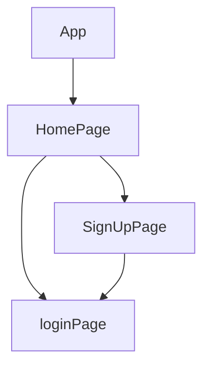

# Cuemath Go! - React Native App

✨   Video Walkthrough :-  

Check out the demo video for a visual walkthrough of the signup and login processes.

## 🔗 Profile Links✨

| Resume | Github                                                                                                                                   | Linkedin                                                                                                                                                            | Portfolio                                                                                                                                    | Blogger                                                                                                                                                           | Medium                                                                                                                                    |
| ------------- | ---------------------------------------------------------------------------------------------------------------------------------------- | ------------------------------------------------------------------------------------------------------------------------------------------------------------------- | -------------------------------------------------------------------------------------------------------------------------------------------- | -------------------------------------------------------------------------------------------------------------------------------------------- | -------------------------------------------------------------------------------------------------------------------------------------------- |
|  | |  | | | |  

## 💫Tech-Stack->

- #### For Frontend:-
   - `react-native`
   - `tailwindCSS`
   - `JavaScript `

   
---
# Project Overview
Welcome to Cuemath Go!, a React Native application focusing on user authentication with dedicated screens for signup and login. This project serves as an assignment submission, emphasizing the integration of React Native fundamentals for a seamless user experience.

# Features
⭕UI Implementation: The app's user interface is designed with a user-centric approach, featuring screens for signup and login.

⭕Signup Screen: A form-based interface allowing new users to register for the application. It provides input fields for essential user information and performs real-time error validation, ensuring data accuracy. Upon successful completion, user data is securely stored.

⭕Login Screen: Existing users can access the application by providing their registered email ID and password. The interface includes input fields for login credentials, error handling for invalid attempts, and a "Login" button for user authentication. data handling via local storage.

⭕Navigation: Setup for smooth transitions between signup and login screens, enhancing the overall user experience.

⭕Integration of Lottie animations:
one-line-wonder-lottie.json
cts-lottie. json
no-attack-knight-bishop.json

⭕Utilization of carousel and bottom sheet components.

# Installation
Detailed instructions on how to install, configure, and get the project running
⭕Open git bash and enter the following commands:-
  git clone - https://github.com/shikhu51197/reactnativenew.git

  npm install
  
✨Download:

Android Users: Expo Go

IOS Users: Expo Go

  npx expo start
  
Scan the QR code using the previously installed Expo Go application, and the application will be visible to you.

# Screenshots

# Home Screen

# Signup Screen
A form-based interface for new user registration.

# Login Screen
Entry point for existing users, providing input fields for email and password.

# Technology Stack
React Native
Expo
JavaScript
tailwind css

## Flow

---
